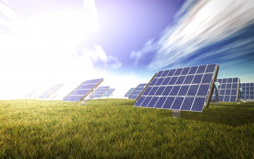

Quelques sites pour expliquer le photovoltaïque:

- [https://solairepv.fr/](https://solairepv.fr/): le site du [CNRS](https://www.cnrs.fr/), 
- [https://www.photovoltaique.info](https://www.photovoltaique.info): le site de [l'association HESPUL](http://www.hespul.org/) soutenu par l'ADEME.

###Les différentes phases d'études

####Étude de rentabilité

Connaître le nombre de panneaux «installables» par rapport à la surface de toiture disponible et de fait la quantité d’électricité produite en condition d’ensoleillement optimum. Le code de l’ Énergie, promulgué en 2017, permet d’installer des toitures solaires de 100 kWc maximum par PDL (Point De Livraison), quel que soit le nombre de clients raccordés et la surface de(s) bâtiment(s).
####Étude d’ombrage
Analyser les ombres portées par la végétation ou les bâtiments voisins pouvant, au fil de la trajectoire du soleil sur une journée et sur l’année, réduire le fonctionnement des panneaux photovoltaïques.
####Étude structure
Savoir si la structure du bâtiment supportera le poids de l’installation des panneaux photovoltaïques et si au préalable de la pose des panneaux, une rénovation du toit (étanchéité et isolation) est nécessaire.
####Étude d’impact visuel
Vérifier, à la demande des Architectes des Bâtiments de France (ABF), que la toiture photovoltaïque située dans un périmètre de 500 m autour d’un bâtiment classé, ne portera pas de préjudice esthétique à ce dernier.

