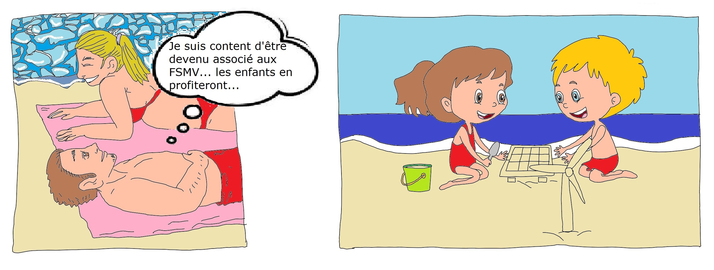

Avant tout, il faut être associé des Fermes Solaires du Mont-Valérien. C’est une garantie pour la communauté que nous partageons les mêmes valeurs et les mêmes objectifs. Lisez nos statuts !

Les Fermes Solaires du Mont-Valérien (FSMV) ont pour objectif la production locale d’électricité photovoltaïque sur les communes des territoires de Paris-Ouest La Défense et des Boucles de Seine. Elles proposent l’autoconsommation collective : partage de l’énergie entre voisins d’un même quartier grâce à des panneaux photovoltaïques installés à proximité.

Découvrez à travers ce guide comment vous pouvez faire partie de notre Communauté Énergétique Citoyenne (CEC) et devenir acteur de la transition écologique tout en bénéficiant des avantages de l’ACC (AutoConsommation Collective).

Nous tenons à préciser que nous sommes des citoyens bénévoles et que chacun apporte du sien à une aventure excitante ne possédant aucune structure d’une entreprise classique mais la volonté est forte pour proposer des solutions originales face au dérèglement climatique. Pour devenir Associé: https://fsmv.fr/associe