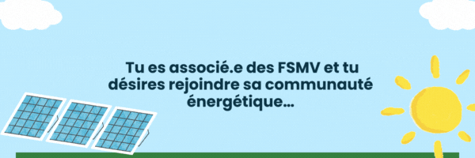
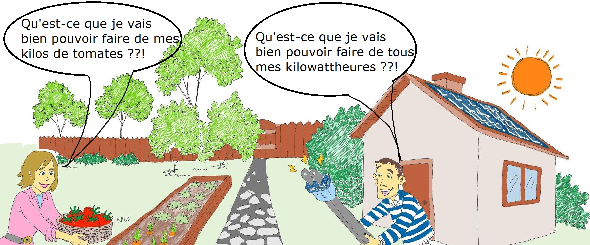
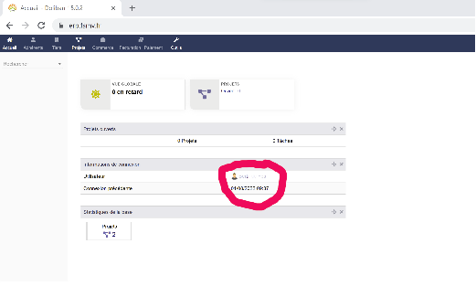

Tu as plusieurs façons de t'impliquer dans la communauté des Fermes Solaires du Mont-Valérien en tant que:
* **consommateur** avec l’avantage de profiter d’une énergie renouvelable produite à moins de 2 km de chez toi, dont le prix est fixe pour au moins 1 an et inférieur ou égal au prix que tu payes actuellement,

ou en tant que:

    producteur (tu as déjà des panneaux solaires et produit de l'électricité) tu peux revendre ton excédent de production à des consommateurs locaux et à un prix généralement supérieur qu’à des fournisseurs de rachat de surplus.
    Si tu n'as pas encore de panneaux solaires, nous pouvons t'aider pour l'installation (études, subventions, prestataire...). Les détails sont dans la page suivante.

Et le rôle des FSMV alors ?

Conformément au code de l’énergie, les FSMV est la Personne Morale Organisatrice de la bonne affectation des consommateurs aux producteurs et vice-versa (le “matchmaker” de l’énergie). A ce titre, elle est dans l’obligation de fournir à Enedis les informations nécessaires pour garantir l'équilibre du réseau électrique. La communauté est essentiellement régie par la convention Enedis.

Il n’y a pas d’obligation de vendre ou d’acheter des kWh en euros1 ni d'établir un contrat d’achat entre un producteur et un consommateur. Cependant les FSMV mettent à disposition de ses associés une facture incluant les conditions générales de vente. Cette facture peut être éditée par les FSMV pour le compte du producteur.

1 les producteurs/consommateurs auront toujours les taxes d’acheminement à s’acquitter (même pour 2 km :-))

       
       
   cliquer sur ton nom,
   
   
       aller sur l’onglet “fichiers joints”
        télécharger le fichier “consentement Enedis” qui devrait être disponible et y renseigner le numéro du PDL que tu trouveras sur ta facture d’énergie, signer le document et le téléverser dans le même onglet à l’emplacement “Ajouter un nouveau document fichier/document”
        tu procéderas à la même opération pour signer ta "lettre d'intention" afin de formaliser ton engagement,
        téléverser également ta facture d’énergie,

 si tu es déjà producteur, il faut également téléverser le document signé suivant que tu dois avoir en ta possession :
            le Contrat d’Accès et d’Exploitation,

envoie-nous un mail (fsmvidf@gmail.com) pour nous prévenir que tu es prêt !

Compte tenu des délais imposés par Enedis, nous reviendrons vers toi d’ici 2 semaines au plus tôt pour confirmer ton éligibilité. Merci !

conseil pour ajouter le N° de PDL au consentement Enedis et le signer

    Utiliser Word ou Libre Office pour ajouter le numéro de PDL à l'endroit idoine,
    Exporter au format PDF,
    Signer le document PDF avec le moyen de ton choix ou en utilisant l'utilitaire sign.fsmv.fr
    Téléverser le document signé dans ton portail FSMV

