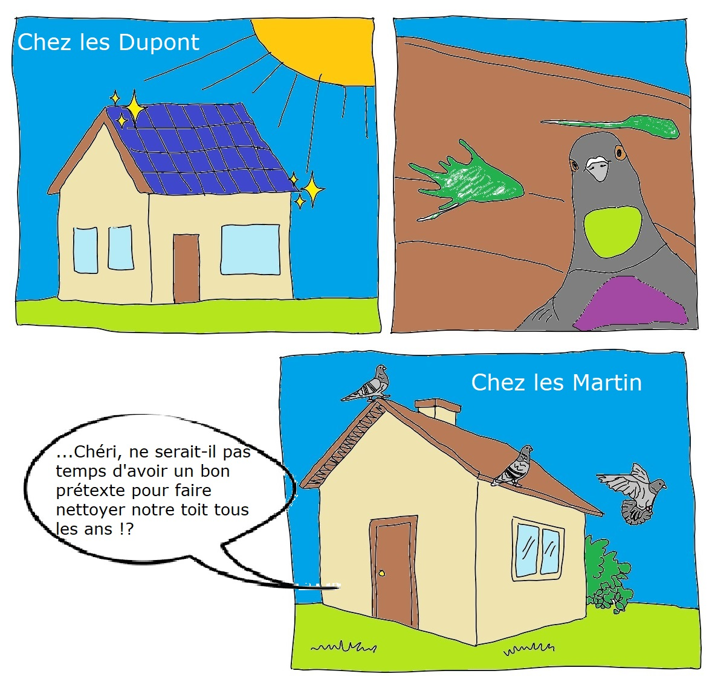

Si tu maîtrises pleinement la disponibilité de ta toiture, les FSMV, au titre de tiers-investisseur, bénéficient de subventions allouées par la Région Île-de-France dont tu pourras également profiter, te permettant de pouvoir auto-consommer ta production et de revendre le surplus de production au sein de la communauté énergétique des FSMV.

C’est une formidable opportunité de participer à la génération d’énergie renouvelable.

A ce jour nous n’avons ni la trésorerie ni assez de bénévoles pour gérer les lignes de crédit et ses frais attachés permettant une gestion optimale de la trésorerie avec les institutions bancaires. Nous entrons également dans une période d’inflation incertaine et nous ne voulons pas gérer des impayés. Aussi nous sollicitons chaque associé désirant équiper son toit d’une production d’énergie renouvelable, d'alimenter son Compte Courant d’Associé (CCA) permettant de ne pas mettre les FSMV en défaut de paiement. Le montant demandé pour alimenter ce CCA, le moment et le délai te sera précisé dès que nous obtenons une réponse de la part de la Région Île-de-France dans le cadre de la demande de subvention. Cette dite demande de subvention sera couplée avec une demande d’avance. Elles seront soumises à vote pour approbation lors de la Commission Paritaire (CP) de la Région Île-de-France.

Nous revisiterons éventuellement cette stratégie pour les Commissions Paritaires futures.

La formalisation de toutes les conditions est disponible dans le contrat d’usage type.

N'hésites pas à nous [contacter](../../../contact) pour de plus amples renseignements.