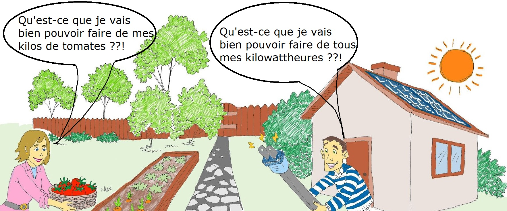

Dans le cadre de l'Autoconsommation Collective, tu as plusieurs façons de t'impliquer dans la communauté énergétique des Fermes Solaires du Mont-Valérien:
* consommateur avec l’avantage de profiter d’une énergie renouvelable produite à moins de 2 km de chez toi,
* producteur en fournissant ton excédent de production aux consommateurs à des conditions très favorables.

#### Et le rôle des FSMV alors ?
Conformément au code de l’énergie, les FSMV est la Personne Morale Organisatrice de la bonne affectation des consommateurs aux producteurs et vice-versa (le “matchmaker” de l’énergie). A ce titre, elle est dans l’obligation de fournir à Enedis les informations nécessaires pour garantir l'équilibre du réseau électrique. La communauté est essentiellement régie par [la convention Enedis](https://www.enedis.fr/sites/default/files/documents/pdf/Enedis-FOR-CF_01E.pdf).

Il n’y a pas d’obligation de vendre ou d’acheter des kWh en euros (il y aura toujours les taxes d’acheminement à s’acquitter) ni d'établir un contrat d’achat entre un producteur et un consommateur. Cependant les FSMV mettent à disposition de ses associés [une facture incluant les conditions générales de vente](https://docs.google.com/document/d/1vWNXZJmdZUROnw0flykCL2obWObmSA7i5DAaSXv4Xds/edit?usp=sharing). Cette facture peut être éditée par les FSMV pour le compte du producteur.

####Avant tout, devenir associé !

Avant tout, il faut être associé des Fermes Solaires du Mont-Valérien. C’est une garantie pour la communauté que nous partageons les mêmes valeurs et les mêmes objectifs. Lisez nos [statuts](https://drive.google.com/file/d/1Wm-hCciqrirz9Dr5PCAuVlpkT0VyI1YP/view?usp=sharing) et notamment le préambule!

Les Fermes Solaires du Mont-Valérien (FSMV) ont pour objectif la production locale d’électricité photovoltaïque sur les communes des territoires de Paris-Ouest La Défense et des Boucles de Seine. Elles proposent l’autoconsommation collective : partage de l’énergie entre voisins d’un même quartier grâce à des panneaux photovoltaïques installés à proximité.

Découvrez à travers ce guide comment vous pouvez faire partie de notre **C**ommunauté **É**nergétique **C**itoyenne (CEC) et devenir acteur de la transition écologique tout en bénéficiant des avantages de l’ACC (**A**uto**C**onsommation **C**ollective).

Nous tenons à préciser que nous sommes des citoyens bénévoles et que chacun apporte du sien à une aventure excitante ne possédant aucune structure d’une entreprise classique mais la volonté est forte pour proposer des solutions originales face au dérèglement climatique. Pour devenir Associé: [https://www.fsmv.fr/associe](https://www.fsmv.fr/associe)